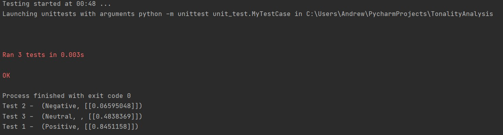

# Результати тестів емоційного забарвлення тексту

+ Текст тесту 1
  
        всем добра и сгущенки
        
+ Текст тесту 2
        
        коллеги сидят рубятся в кс а я из-за долбанной винды не могу

+ Текст тесту 3
    
        большие емкости для перевозки жидкостей нефти и продуктов ее переработки часто используются в виде вагонов поездов  


 ## Результати тестів:



 ## Код UNIT-тесту:
 ```python
     import unittest
from test.test_1_ru import test_positive
from test.test_2_ru import test_negative
from test.test_3_ru import test_neutral


class MyTestCase(unittest.TestCase):

    def test_neutral(self):
        self.assertEqual('neu', test_neutral())

    def test_positive(self):
        self.assertEqual('pos', test_positive())

    def test_negative(self):
        self.assertEqual('neg', test_negative())


if __name__ == '__main__':
    unittest.main()
```
